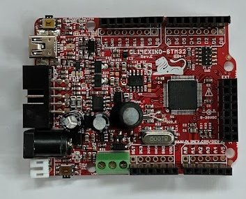

===============
olimexino-stm32
===============

.. tags:: chip:stm32, chip:stm32f1, chip:stm32f103, arch:arm, vendor:olimex

   Olimexino STM32 (Rev.E)

This board is a mix between the `Leaflabs Maple`_ and a classic Arduino with
added features. It's produced by Olimex in Bulgaria, first released around 2011.

.. _Leaflabs Maple: ../maple/index.html

The board features Arduino shield connectors as well as a duplicate set of
those but aligned to a 100mil grid. On top of the Maple features, it adds
1 cell LiPo/Li-ion (+charging), CAN transceiver, SD-Card socket and Olimex
specific "UEXT" extension connectors. Olimex offers UEXT modules which you can
use to further extend functionality.

The board has an extensive IO set and can be further customized by opening or
closing solder pad jumpers.

Usefull links
-------------

- `Product page <https://www.olimex.com/Products/Duino/STM32/OLIMEXINO-STM32/open-source-hardware>`__
- `User manual <https://www.olimex.com/Products/Duino/STM32/OLIMEXINO-STM32/resources/OLIMEXINO-STM32.pdf>`__
- `Latest schematic <https://www.olimex.com/Products/Duino/STM32/OLIMEXINO-STM32/resources/OLIMEXINO-STM32_sch_latest.pdf>`__

Features
--------

* STM32F103RBT6 microcontroller
* DC power source 9-30V DC
* Low standy power design
* LiPo/Li-ion battery connector with built in charger
* UEXT connector: 3V3, UART (3V3 level), I2C and SPI
* 32768Hz crystal for the RTC
* MCP2551 CAN bus driver
* microSD-card slot
* USB connector (mini B on earlier models, USB C on newer)
* standard 10pin ARM JTAG/SWD connector

Buttons & LEDs
==============

Buttons:

* RESET button, next to CAN screw terminal
* BOOT0/user button, next to USB connector, enabled with
  ``CONFIG_ARCH_BUTTONS``, active high, constant ``BUTTON_BOOT0_BIT``.

The Olimexino-STM32 board has three LEDs:

=========  ======  =================  ==============================
Label      Color   GPIO/Power rail    Notes
=========  ======  =================  ==============================
Power LED  Red     +5V                Unlit when battery powered
LED1       Green   PA5                Active high
LED2       Yellow  PA1                Active high
=========  ======  =================  ==============================

LED behavior depends on whether ``CONFIG_ARCH_LEDS`` is enabled. When
``CONFIG_ARCH_LEDS`` is not set, the LEDs are exposed via the standard NuttX
user LED interface (``board_userled(int led, bool ledon)`` &
``board_userled_all(uint32_t ledset)``). The led constants are
``BOARD_LED1`` / ``BOARD_LED_GREEN`` and ``BOARD_LED2`` / ``BOARD_LED_YELLOW``.

When ``CONFIG_ARCH_LEDS`` is set, NuttX drives the LEDs automatically to
reflect system state. The green LED reflects normal OS lifecycle; the yellow
LED signals transient events (IRQ, signal, panic).

=======================    ======  ========
System state               Green   Yellow
=======================    ======  ========
NuttX has been started     OFF     OFF
Heap has been allocated    OFF     OFF
Interrupts enabled         OFF     OFF
Idle stack created         ON      OFF
In an interrupt            N/C     ON
In a signal handler        N/C     ON
An assertion failed        N/C     ON
The system has crashed     N/C     Blinking
MCU is idle                OFF     N/C
=======================    ======  ========

So once booted, the green LED will indicate CPU activity. If the Yellow LED is
flashing at approximately 2Hz, a fatal error has been detected and the system
has halted.

Pin Mapping
===========

The board offers following IO connectors:

- **CAN**: 3 screw terminal for CAN bus
- **D**: Digital Arduino/Maple-style header
- **A**: Analog Arduino/Maple-style header
- **UEXT**: Olimex UEXT right angle male 10 pin header
- **EXT**: straight female 20 pin header
- **JTAG/SWD**: straight male 10pin standard ARM debug header

The 64 pins of the STM32F103RBT6 are mapped as follows:

====  ==========  ==========  ===============================  ========
Pin   Signal      GPIO        Connector(s)                     Notes
====  ==========  ==========  ===============================  ========
1     VDD (VBat)
2     D21         PC13                                         CAN_CTRL
3     D22         PC14                                         32.768kHz OSC in
4     D23         PC15        EXT1 [1]_                        32.768kHz OSC out
5     Osc in      PD0                                          8MHz OSC in
6     Osc out     PD1                                          8MHz OSC in
7     Reset                   RST Button, JTAG/SWD, PWR1
8     D15         PC0         A0
9     D16         PC1         A1
10    D17         PC2         A2
11    D18         PC3         A3
12    GND
13    VDDA
14    D2          PA0         D2
15    D3          PA1         D3                               LED2
16    D1          PA2         D1                               USART2 TX
17    D0          PA3         D0                               USART2 RX
18    GND
19    VDD
20    D10         PA4         D10, UEXT10 [1]_                 SPI1 #SS
21    D13         PA5         D13, UEXT9                       SPI1 SCK/LED1
22    D12         PA6         D12, UEXT7                       SPI1 MISO
23    D11         PA7         D11, UEXT8                       SPI1 MOSI
24    D19         PC4         A4
25    D20         PC5         A5
26    D27         PB0                                          VBat sense
27    D28         PB1                                          VBat sense low
28    BOOT1       PB2                                          Fixed GND
29    D29         PB10        UEXT5, EXT7                      I2C2 SCL
30    D30         PB11        UEXT6, EXT8                      I2C2 SDA
31    GND
32    VDD
33    D31         PB12        EXT9                             SPI2 #SS
34    D32         PB13        EXT10, MMC                       SPI2 SCK
35    D33         PB14        EXT11, MMC                       SPI2 MISO
36    D34         PB15        EXT12, MMC                       SPI2 MOSI
37    D35         PC6         EXT13
38    D36         PC7         EXT14
39    D37         PC8         EXT15
40    BOOT0       PC9         BOOT Button
41    D6          PA8         D6
42    D7          PA9         D7, UEXT3                        USART1 TX
43    D8          PA10        D8, UEXT4                        USART1 RX
44    USBDM       PA11        USB
45    USBDP       PA12        USB
46    TMS/SWDIO   PA13        JTAG/SWD
47    GND
48    VDD
49    TCK/SWCLK   PA14        JTAG/SWD
50    TDI         PA15        JTAG/SWD
51    D26         PC10        EXT4
52    USB_P       PC11
53    DISC        PC12
54    D25         PD2         MMC                              MMC_CS
55    TDO/SWO     PB3         JTAG/SWD
56    TRST        PB4         JTAG/SWD [1]_
57    D4          PB5         D4, UEXT10 [1]_
58    D5          PB6         D5                               I2C1 SCL
59    D9          PB7         D9                               I2C1 SDA
60    BOOT0                   BOOT Button
61    D14         PB8         D14, CAN                         CAN RX
62    D24         PB9         EXT2, CAN                        CAN TX
63    VDD
64    GND
====  ==========  ==========  ===============================  ========

.. [1] Solder jumper options available.

Power Supply
============

The board can be powered through:

* USB
* DC jack plug, 9-30V, center pin is positive, polarity protected
* Arduino power connector, pin 6, 9-30V, NOT polarity protected
* Single cell LiPo/Li-ion battery

If a battery is connected and when powered from the DC jack or USB, the battery
will be charged at 70mA, topping off at 4.20V.

.. note::

  Since board Rev.B, the voltage of the battery can be measured through a
  resistor divider (3M/1M, so 4:1 scaling). To enable this resistor divider, GPIO
  PB1 should be set as output to '0' during the measurement. The voltage can be
  measured on ``ADC8 (PB0)``. Be aware of the very high source impedance - and thus
  long acquisition time - of this voltage input.

Interfaces
==========

USB
---

The device's USB signals are routed to the external USB connector with ESD
protection.

Some special GPIO's related to USB:
- GPIO_USB_VBUS: USB power detect ``USB_P`` (PC11): handled by STM32 USB driver
- GPIO_USB_PULLUPN: soft disconnect ``DISC`` (PC12): handled by board code

CAN-bus
-------

A 3 pin screw terminal provides connection to a CAN bus. A solder jumper allows
on board 120Ohm termination.

Signal ``CAN_CTRL`` (PC13) allows the CAN transceiver to be put in standby or
SLEEP mode, by setting this GPIO high ('1'). In this mode, the receiver still
works (but at a lower current) and the transmitter is disabled.

Note that in order to use the CAN bus, it has to use the alternate function
remapping of the STM32F103, ``CONFIG_STM32_CAN1_REMAP1``.

Can connector pinning:

- 1: GND
- 2: CANL
- 3: CANH

USART
-----

The board provides two USART ports:

- USART1: in UEXT and digital connector
- USART2: in digital connector

If only an additional output is needed, USART3 TX can be enabled on D26 (PC10),
in the extension connector.

.. todo::

  Only USART1 is currently implemented and tested (on UEXT). USART2 and USART3
  are not tested yet.

I2C
---

There are 2 I2C busses wired to connectors:

- I2C1: digital connector ``(D5-D9)``
- I2C2: UEXT and Extension connector

.. todo::

  No configurations are testing the I2C interfaces.

SPI
---

These two busses allow connection to SPI peripherals with their respective slave
select mapping.

- SPI1:
   - Digital connector: native SS ``D10 (PA4)``, defined as ``USER_CSN``
   - UEXT: ``D4 (PB5)`` or native SS ``D10 (PA4)``, depending on solder jumper (default D4)
- SPI2:
   - Extension connector: native SS ``D31 (PB12)``, defined as ``MMCSD_CSN``
   - MMC: ``D25-MMC_CS (PD2)``

.. todo::

  For SPI1, only the native SS is implemented (``D10 (PA4)``).
  For SPI2, only the MMC CS is implemented (``D25-MMC_CS (PD2)``).
  No configurations are testing SPI1.

ADC
---

Available for connecting analog input voltages (and not multiplexed on
interfaces above) are:

- ADC10: ``D15 - Analog 0``
- ADC11: ``D16 - Analog 1``
- ADC12: ``D17 - Analog 2``
- ADC13: ``D18 - Analog 3``
- ADC14: ``D19 - Analog 4``
- ADC15: ``D20 - Analog 5``

Next to this, there's the battery monitoring on ADC8.

.. todo::

  ADC's have not been configured by this board port yet.

Building NuttX
==============

See default chip building instructions **TODO**.

Flashing
========

See default chip flashing instructions **TODO**.

Configurations
==============

All configurations are based on the minimal NSH configuration and share the
following defaults:

- USART1 as serial console (115200 8N1)
- JTAG full enable
- Debug symbols, full optimization
- ``CONFIG_MM_SMALL`` enabled for 20KB RAM
- Stack dump on fault
- procfs mounted at ``/proc``

nsh
---

Minimal NSH configuration. Intended as a known-good baseline and starting
point for deriving other configurations.

Enabled peripherals: USART1 (console).

smallnsh
--------

Variant of the ``nsh`` configuration with ``CONFIG_DEFAULT_SMALL=y``, which
reduces default buffer sizes and disables optional OS features to further
minimize RAM usage. Use this as a starting point when RAM pressure is a
concern.

leds-buttons
------------

Extends ``nsh`` with LED and button support using the userspace LED and input
button frameworks.

Use the ``leds`` builtin app to test the leds::

  nsh> leds

The ``buttons`` builtin app demonstrates button events::

  nsh> buttons

On-board LED control is disabled (``CONFIG_ARCH_LEDS`` not set) so the LEDs
are fully available to userspace.

can
---

Extends ``nsh`` with CAN1 support. CAN1 is remapped to PB8/PB9
(``CONFIG_STM32_CAN1_REMAP1``). Includes the ``examples/can`` builtin app
for bus testing. Loopback is disabled, so test with an external device.

Bit timing is configured for 250000bits/s (TSEG1=13, TSEG2=2) assuming 36 MHz
APB1 clock. Adjust ``CONFIG_STM32_CAN_TSEG1`` and ``CONFIG_STM32_CAN_TSEG2``
for different bitrates.

mmcsd
-----

Extends ``nsh`` with SD card support over SPI2. The SD card is created as
``/dev/mmcsd0`` and can be mounted manually from NSH::

  nsh> mount -t vfat /dev/mmcsd0 /mnt

composite
---------

Extends ``mmcsd`` with USB composite device support: CDC/ACM (virtual serial
port) and USB Mass Storage (MSC) backed by the SPI2 SD card.

The composite device is connected manually from NSH using the ``conn``
builtin app::

  nsh> conn

The SD card is exposed as a USB mass storage device (``/dev/mmcsd0``). The
CDC/ACM interface appears as a virtual serial port on the host.

Buffer sizes are configured to fit in the 20KB RAM but not tuned aggressively.
